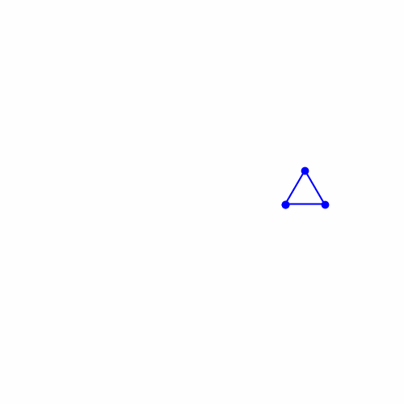

# 🧪 1. Transformaciones Básicas

## 📅 Fecha
`2025-05-01` 


## 🎯 Objetivo del Taller

Describe brevemente el objetivo del taller: ¿qué se pretende explorar, aplicar o construir?

---

## 🧠 Conceptos Aprendidos

Lista los principales conceptos aplicados:

- [ ] Transformaciones geométricas (escala, rotación, traslación)
- [ ] Segmentación de imágenes
- [ ] Shaders y efectos visuales
- [ ] Entrenamiento de modelos IA
- [ ] Comunicación por gestos o voz
- [ ] Otro: _______________________

---

## 🔧 Herramientas y Entornos

Especifica los entornos usados:

- Python (`opencv-python`, `torch`, `mediapipe`, `diffusers`, etc.)
- Unity (versión LTS, XR Toolkit, Shader Graph)
- Three.js / React Three Fiber
- Jupyter / Google Colab

---

## 🧪 Implementación

### 🔹 Etapas realizadas
1. Preparación de datos o escena.
2. Aplicación de modelo o algoritmo.
3. Visualización o interacción.
4. Guardado de resultados.

### 🔹 Código relevante

Incluye un fragmento que resuma el corazón del taller:

```python
# Segmentación semántica con DeepLab
output = model(input_tensor)['out']
prediction = output.argmax(1).squeeze().cpu().numpy()
```

---

## 📊 Resultados Visuales

### Python


### Three.js


### Processing


---

## 🧩 Prompts Usados


---

## 💬 Reflexión Final

Responde en 2-3 párrafos:

- ¿Qué aprendiste o reforzaste con este taller?
- ¿Qué parte fue más compleja o interesante?
- ¿Qué mejorarías o qué aplicarías en futuros proyectos?

---

## 👥 Contribuciones Grupales (si aplica)

```markdown
- Programé el detector de postura en MediaPipe
- Generé los GIFs y documentación
- Integré el control de voz con visualización en Unity
```

---

## ✅ Checklist de Entrega

- [x] Carpeta `YYYY-MM-DD_nombre_taller`
- [x] Código limpio y funcional
- [x] GIF incluido con nombre descriptivo (si el taller lo requiere)
- [x] Visualizaciones o métricas exportadas
- [x] README completo y claro
- [x] Commits descriptivos en inglés
