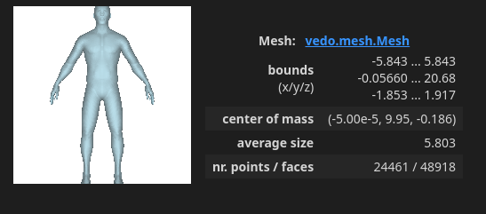
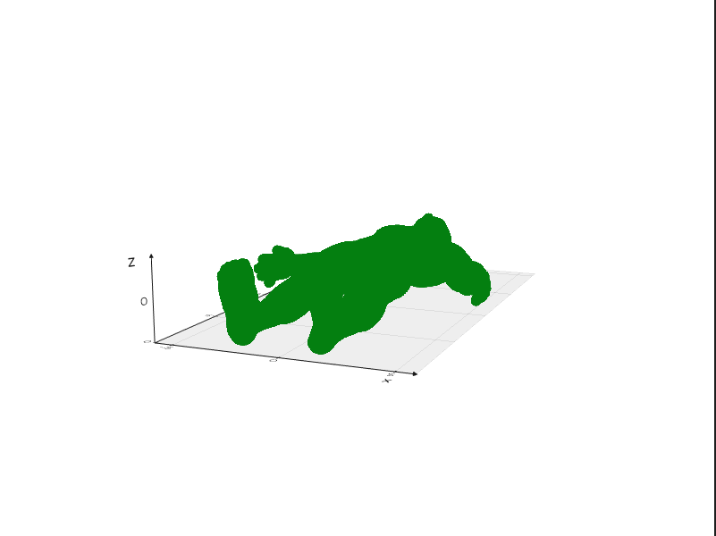

# 🧪 1. Construyendo un mundo 3D

## 📅 Fecha
`2025-05-03` 


## 🎯 Objetivo del Taller

Comprender las estructuras gráficas básicas que forman los modelos 3D (mallas poligonales) y visualizar su estructura en distintas plataformas. Se explorará la diferencia entre vértice, arista y cara, así como el contenido de formatos de archivo estándar de malla como .OBJ, .STL y .GLTF.

---

## 🧠 Conceptos Aprendidos

Lista los principales conceptos aplicados:

- Archivos estandar de malla
- Estructura de los modelos (vertives, arista y cara)
---

## 🔧 Herramientas y Entornos

Especifica los entornos usados:

- Python ( `vedo`, `trimesh`)
- Three.js / React Three Fiber (`OrbitControls`)

---

## 🧪 Implementación

### 🔹 Etapas realizadas
1. Preparación de datos y entorno.
2. Implementación de los algortimos
3. Visualización o interacción.
4. Guardado de resultados.

### 🔹 Código relevante

### Python

```python
# === Extract geometry info ===
vertices = mesh_trimesh.vertices
faces = mesh_trimesh.faces
```

### Código Threejs
```python
<Edges
        geometry={scene.children[0].geometry} // Primera malla del modelo
        scale={1.01} // Ligeramente más grande para evitar solapamiento visual
        threshold={15} // Ángulo para detectar aristas duras
        color="black"
      />

      {/* Mostrar vértices como puntos */}
      <Points
        geometry={scene.children[0].geometry}
        scale={1.02}
      >
```

## 📊 Resultados Visuales


### Python




### Three.js

[Video on Youtube](https://youtube.com/shorts/A04FjK2F5_g)

---

## 💬 Reflexión Final

Interesante poder trabajar con modelos desde Python. No conocía las librerías Vedo ni trimesh