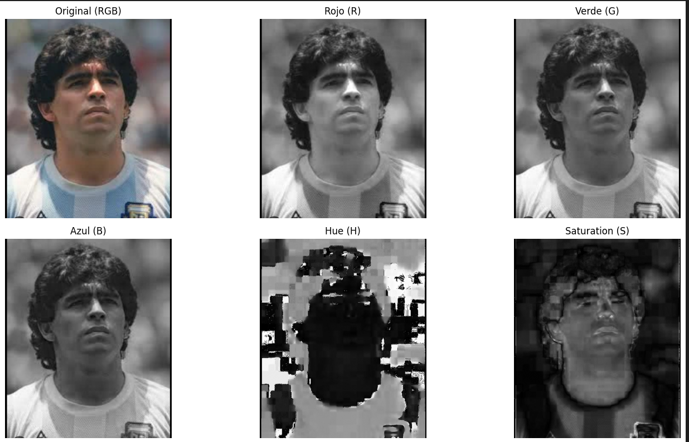
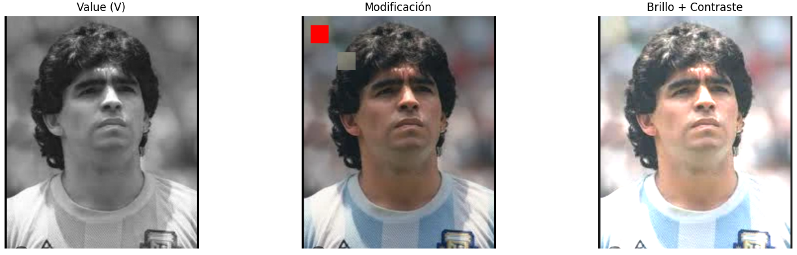
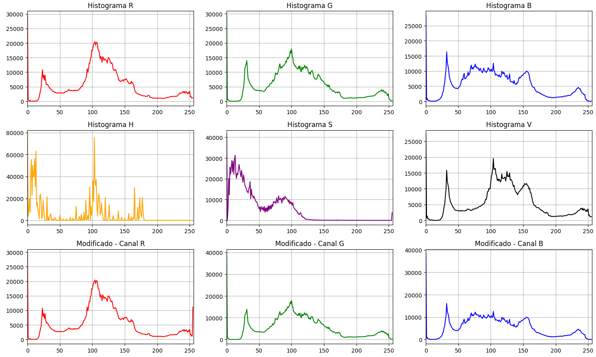
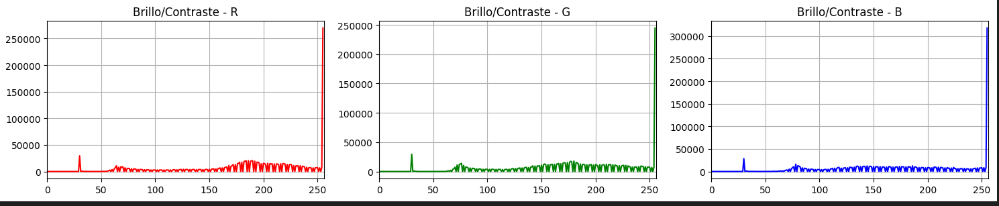

# 🧪 5. De Pixels a Coordenadas: Explorando la Imagen como Matriz

## 📅 Fecha
`2025-05-04` 


## 🎯 Objetivo del Taller

Comprender cómo se representa una imagen digital como una matriz numérica y manipular sus componentes a nivel de píxel. Se abordará cómo trabajar con los valores de color y brillo directamente, accediendo a regiones específicas de la imagen para su análisis o modificación.

---

## 🧠 Conceptos Aprendidos

Lista los principales conceptos aplicados:

- Canales RGB y HSV
- Slicing de matrices
- Intensidades
- Librerías de visión por computadora
---

## 🔧 Herramientas y Entornos

Especifica los entornos usados:

- Python (`cv2`,`numpy`,`matplotlib`)

---

## 🧪 Implementación

### 🔹 Etapas realizadas
1. Preparación de datos y entorno.
2. Implementación de los algortimos
3. Visualización o interacción.
4. Guardado de resultados.

### 🔹 Código relevante

### Código Python 
```python
# Convertir a HSV
img_hsv = cv2.cvtColor(img, cv2.COLOR_BGR2HSV)
H, S, V = cv2.split(img_hsv)
```

```python
# 2. Acceder y mostrar los canales RGB
R, G, B = cv2.split(img_rgb)
```

```python
# 4. Slicing: copiar una región y pegarla en otro lugar
height, width = img_rgb.shape[:2]
roi = img_rgb[50:150, 50:150].copy()
if 200 + roi.shape[0] <= height and 200 + roi.shape[1] <= width:
    img_mod[200 : 200 + roi.shape[0], 200 : 200 + roi.shape[1]] = roi
else:
    print("La región destino está fuera de los límites de la imagen.")
```


```python
# Sobel X y Y
sobelx = cv2.Sobel(img_gray, cv2.CV_64F, 1, 0, ksize=3)
sobely = cv2.Sobel(img_gray, cv2.CV_64F, 0, 1, ksize=3)
sobel_combined = cv2.magnitude(sobelx, sobely)
```

## 📊 Resultados Visuales







---

## 💬 Reflexión Final

Me gustó mucho la facilidad con la que se pueden obtener los resultados usando opencv y matplotlib