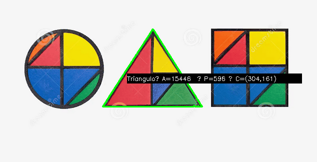

# 🧪 7. Análisis de Figuras Geométricas: Centroide, Área y Perímetro

## 📅 Fecha
`2025-05-04` 


## 🎯 Objetivo del Taller

Detectar formas simples (círculos, cuadrados, triángulos) en imágenes binarizadas y calcular propiedades geométricas como área, perímetro y centroide. El objetivo es desarrollar habilidades para extraer métricas relevantes de contornos detectados en imágenes procesadas.

---

## 🧠 Conceptos Aprendidos

Lista los principales conceptos aplicados:

- Binarización
- Paquete OpenCV
---

## 🔧 Herramientas y Entornos

Especifica los entornos usados:

- Python (`cv2`,`numpy`,`matplotlib`)

---

## 🧪 Implementación

### 🔹 Etapas realizadas
1. Preparación del entorno.
2. Implementación de los algortimos
3. Visualización o interacción.
4. Guardado de resultados.

### 🔹 Código relevante

### Código Python 
```python
# 2. Binarizar
_, binary = cv2.threshold(gray, 127, 255, cv2.THRESH_BINARY_INV)

```

```python
# 3. Encontrar contornos
contours, _ = cv2.findContours(binary, cv2.RETR_EXTERNAL, cv2.CHAIN_APPROX_SIMPLE)
```

```python
    # Calcular área y perímetro
    area = cv2.contourArea(cnt)
    perimeter = cv2.arcLength(cnt, True)
```

```python
# Calcular centroide
    M = cv2.moments(cnt)
    if M["m00"] != 0:
        cx = int(M["m10"] / M["m00"])
        cy = int(M["m01"] / M["m00"])
    else:
        cx, cy = 0, 0
```
```python
# Aproximar contorno para identificar figura
    approx = cv2.approxPolyDP(cnt, 0.04 * perimeter, True)
    vertices = len(approx)
    if vertices == 3:
        shape = "Triángulo"
    elif vertices == 4:
        shape = "Cuadrado"
    elif vertices > 4:
        shape = "Círculo"
    else:
        shape = "Desconocida"
```

## 📊 Resultados Visuales

### Figuras encontradas con sus respectivas areas y perímetros


---

## 💬 Reflexión Final

Tuve dificultades generando el gift e intentando ajustar el texto para que se lograra ver medianamente bien