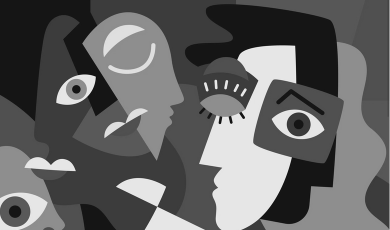

# 🧪 8. Filtro Visual: Convoluciones Personalizadas

## 📅 Fecha
`2025-05-04` 


## 🎯 Objetivo del Taller

Diseñar e implementar filtros personalizados en imágenes para modificar bordes, difuminar o realzar detalles. Este taller busca profundizar en el concepto de convolución y su impacto visual en el procesamiento de imágenes.

---

## 🧠 Conceptos Aprendidos

Lista los principales conceptos aplicados:

- Aplicación de kernels personalizados
- Detección de esquinas

---

## 🔧 Herramientas y Entornos

Especifica los entornos usados:

- Python (`cv2`,`numpy`,`matplotlib`)

---

## 🧪 Implementación

### 🔹 Etapas realizadas
1. Preparación del entorno.
2. Implementación de los algortimos
3. Visualización o interacción.
4. Guardado de resultados.

### 🔹 Código relevante

### Código Python 
```python
#Implementar la convolución 2D manual
def convolve2d(image, kernel):
    kh, kw = kernel.shape
    pad_h, pad_w = kh // 2, kw // 2
    padded = np.pad(image, ((pad_h, pad_h), (pad_w, pad_w)), mode='constant', constant_values=0)
    output = np.zeros_like(image)

    for i in range(image.shape[0]):
        for j in range(image.shape[1]):
            region = padded[i:i+kh, j:j+kw]
            output[i, j] = np.clip(np.sum(region * kernel), 0, 255)
    
    return output.astype(np.uint8)

```

```python
#Definir y aplicar kernels personalizados

# 1. Enfocar
kernel_sharpen = np.array([[0, -1, 0],
                           [-1, 5, -1],
                           [0, -1, 0]])

# 2. Suavizado (Blur)
kernel_blur = np.ones((3, 3), dtype=np.float32) / 9

# 3. Borde (Sobel + cruzado aproximado)
kernel_edge = np.array([[-1, -1, -1],
                        [-1, 8, -1],
                        [-1, -1, -1]])

# Aplicar convoluciones manuales
img_sharpen = convolve2d(img, kernel_sharpen)
img_blur = convolve2d(img, kernel_blur)
img_edge = convolve2d(img, kernel_edge)

```


## 📊 Resultados Visuales

### Figuras encontradas con sus respectivas areas y perímetros


---

## 💬 Reflexión Final

Me pareció divertido poder aplicar filtros con kernels