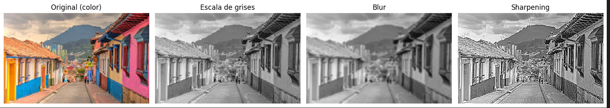
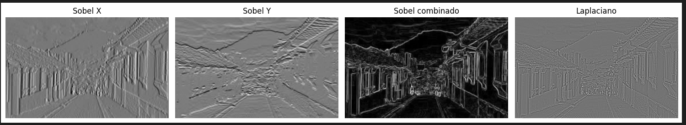

# 🧪 3. Ojos digitales: visión artificial

## 📅 Fecha
`2025-05-04` 


## 🎯 Objetivo del Taller

Entender los fundamentos de la percepción visual artificial mediante imágenes en escala de grises, filtros y detección básica de bordes. Se trabajará con OpenCV para explorar cómo los computadores interpretan imágenes visuales básicas.

---

## 🧠 Conceptos Aprendidos

Lista los principales conceptos aplicados:

- Filtros Sobel
- Filtros convolucionales
- Filtro laplaciano
- Librerías de visión por computadora
---

## 🔧 Herramientas y Entornos

Especifica los entornos usados:

- Python (`opencv`,`numpy`,`matplotlib`)

---

## 🧪 Implementación

### 🔹 Etapas realizadas
1. Preparación de datos y entorno.
2. Implementación de los algortimos
3. Visualización o interacción.
4. Guardado de resultados.

### 🔹 Código relevante

### Código Python aplicando filtros
```python
# 2. Convertir a escala de grises
img_gray = cv2.cvtColor(img_color, cv2.COLOR_RGB2GRAY)
```

```python
# 3. Filtro de desenfoque (blur)
blur = cv2.GaussianBlur(img_gray, (5, 5), 0)
```


```python
# 4. Filtro de realce (sharpening)
kernel_sharpen = np.array([[0, -1, 0], [-1, 5, -1], [0, -1, 0]])
sharpen = cv2.filter2D(img_gray, -1, kernel_sharpen)
```
```python
# Sobel X y Y
sobelx = cv2.Sobel(img_gray, cv2.CV_64F, 1, 0, ksize=3)
sobely = cv2.Sobel(img_gray, cv2.CV_64F, 0, 1, ksize=3)
sobel_combined = cv2.magnitude(sobelx, sobely)
```

## 📊 Resultados Visuales





---

## 💬 Reflexión Final

Me gustó mucho la facilidad con la que se pueden obtener los resultados usando opencv y matplotlib