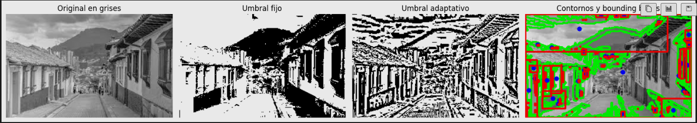
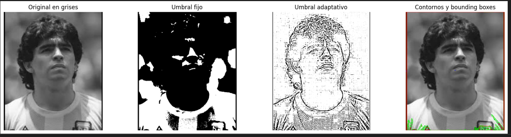
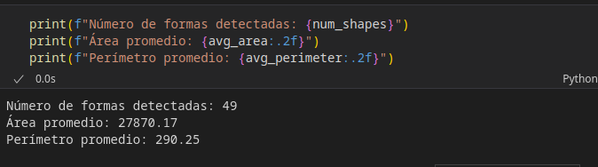

# 🧪 4. Segmentando el Mundo: Binarización y Reconocimiento de Formas

## 📅 Fecha
`2025-05-04` 


## 🎯 Objetivo del Taller

Aplicar técnicas básicas de segmentación en imágenes mediante umbralización y detección de formas simples. El objetivo es comprender cómo identificar regiones de interés en imágenes mediante procesos de binarización y análisis morfológico.

---

## 🧠 Conceptos Aprendidos

Lista los principales conceptos aplicados:

- Binarización y análisis morfológico
- Umbralización

---

## 🔧 Herramientas y Entornos

Especifica los entornos usados:

- Python (`opencv`,`numpy`,`matplotlib`)

---

## 🧪 Implementación

### 🔹 Etapas realizadas
1. Preparación de datos y entorno.
2. Implementación de los algortimos
3. Visualización o interacción.
4. Guardado de resultados.

### 🔹 Código relevante

### Código Python aplicando filtros
```python
# 1. Umbralización fija
_, thresh_fixed = cv2.threshold(img, 127, 255, cv2.THRESH_BINARY)
```

```python
# 2. Umbralización adaptativa
thresh_adaptive = cv2.adaptiveThreshold(
    img, 255, cv2.ADAPTIVE_THRESH_MEAN_C, cv2.THRESH_BINARY, blockSize=11, C=2
)
```


```python
# 3. Detección de contornos (usamos la binarización adaptativa)
contours, _ = cv2.findContours(
    thresh_adaptive, cv2.RETR_EXTERNAL, cv2.CHAIN_APPROX_SIMPLE
)
```
```python
# 5. Calcular momentos, centros de masa, y bounding boxes
total_area = 0
total_perimeter = 0
for contour in contours:
    M = cv2.moments(contour)
    if M["m00"] != 0:
        cX = int(M["m10"] / M["m00"])
        cY = int(M["m01"] / M["m00"])
        cv2.circle(img_color, (cX, cY), 4, (255, 0, 0), -1)

    x, y, w, h = cv2.boundingRect(contour)
    cv2.rectangle(img_color, (x, y), (x + w, y + h), (0, 0, 255), 2)

    total_area += cv2.contourArea(contour)
    total_perimeter += cv2.arcLength(contour, True)
```

## 📊 Resultados Visuales







---

## 💬 Reflexión Final

Muy poderoso Opencv. Bastante interesante las aplicaciones que estos ejemplos pueden tener más adelante